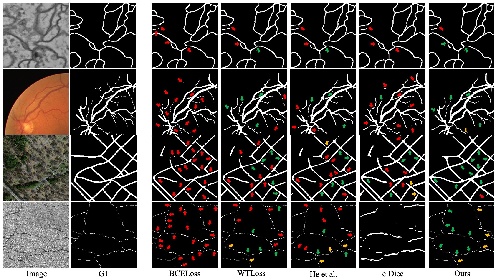

# SATLoss

## Topology-Preserving Image Segmentation with Spatial-Aware Persistent Feature Matching

arXiv: [link](https://arxiv.org/abs/2412.02076);   ICCV Proceedings: [link](https://openaccess.thecvf.com/content/ICCV2025W/BIC/papers/Wen_Topology-Preserving_Image_Segmentation_with_Spatial-Aware_Persistent_Feature_Matching_ICCVW_2025_paper.pdf).

Original Github page: [bw](https://github.com/bw05025/SATLoss)

### Introduction
Topology-preserving image segmentation loss function for curvilinear structure segmentation with spatially-aware persistent feature matching leveraging critical cell locations. Prior work (BMLoss) addressing similar topological feature matching accuracy issue is computationally expensive (O(n³) time complexity, n is number of pixels in an image) and is impractical for many applications. Our method introduces no additional complexity to computing the persistent homology (O(nlog(n))). While achieving comparable performance, it is much more efficient and allows wider applications.
A high-level overview:

Matching examples (0/1-persistent features):

Final segmentation examples:

### SATLoss Implementation
For implementation of the Spatial-Aware Topological Loss (SATLoss), check `PDMatchingLoss` in `./utils/losses.py` and `SpatialAware_WassersteinDistance` in `./utils/PDMatching.py`.

### Run The Code
Dependencies:
<pre>
python==3.9.18
torch==2.1.0
numpy==1.26.0
scikit-image==0.24.0
opencv-python==4.8.1.78
gudhi==3.9.0
torch-topological==0.1.7
POT==0.8.2
</pre>

To train using the topological loss:
<pre>
python3 run.py --expmode train --dataset dataset_name --exp note_for_this_run
</pre>
Hyperparamters varies from dataset to dataset, check paper and modify via parser in `run.py`.

To run inference:
<pre>
python3 run.py --expmode test --dataset dataset_name --exp note_for_this_run
</pre>

Checkpoints and results are saved to `./exp/note_for_this_run`.

### Data Organization
Put images and labels (support any format cv2.imread can read) of respective set (train/val/test) into `./data/dataset_name/set`. An example is provided in `./data`.

`dataset_name` needs to be the same with `--dataset_name xxx` when runing `run.py`.

Names of corresponding input images and labels need to be the same.

